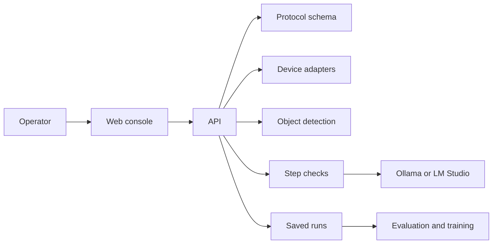

# OpenLabOS

OpenLabOS is an open-source **protocol runner** for camera-assisted laboratory
work. It shows a versioned protocol one step at a time and records what
happened as an append-only session. Optional device and model paths can add
frames and structured step judgments.

The point of the stack is not a chat next to a procedure. It is a shared,
forkable record of **which protocol ran, what the operator did, and what
evidence supported each advance** — without requiring a cloud vendor.

OpenLabOS is **pre-1.0 research software**. It is not validated for clinical,
diagnostic, safety-critical, or regulated laboratory use.

**Why this exists:** [docs/architecture/why-openlabos.md](docs/architecture/why-openlabos.md)

## Quickstart: software-only demonstration

No laboratory hardware or cloud credentials are required.

```bash
docker compose up --build --wait
```

Open <http://localhost:3847/operate/kitchen>, select **Tea preparation**, and
start a guided run. The stack uses deterministic object detection. Interactive
step judgments use Ollama on the host when it is available.

With Node 20+ and pnpm, verify the connections and complete a protocol through
the API:

```bash
pnpm compose:smoke
pnpm compose:protocol-run
pnpm compose:restart-persistence
```

| Script | What it proves |
| --- | --- |
| `compose:smoke` | Web bundle, health/ready probes, perception sidecar, mock judgment bridge |
| `compose:protocol-run` | Full kitchen-tea session finalized through the API |
| `compose:restart-persistence` | Its own session and events survive `docker compose restart api` |

For interactive model judgments:

```bash
ollama pull llama3.2-vision
ollama serve
```

Copy `.env.compose.example` to `.env` only when changing defaults. See the
[Docker Compose runbook](docs/runbooks/docker-compose.md).

`docker compose down` keeps session volumes;
`docker compose down --volumes` deletes them.

Expected results and failure diagnosis:
[First successful run](docs/runbooks/first-successful-run.md).

## What a run records

| Record | Meaning |
| --- | --- |
| **Protocol** | Versioned sequence of steps, criteria, and vocabulary |
| **Session** | One attempt to execute a protocol |
| **SessionEvent** | Append-only history; replaying it reconstructs session state |
| **Judgment** | A model, human, or hybrid producer’s verdict on one step |
| **RunManifest** | Intended closure: protocol hash, events, judgments, artifact pointers |

Schemas live in `packages/protocol`. The API uses them directly. Python
services still use local models in places; the training package can regenerate
Python types from the emitted JSON Schema.

**Evidence honesty.** Measurement criteria declare acceptance ranges. They
become measurements only when a `measurement_recorded` event or criterion
evidence carries `method: instrument` or `display_readout`. A vision judgment
without that method is an estimate. See
[Writing a protocol](docs/protocols/authoring.md).

Examples under `examples/protocols/`: kitchen tea (integration fixture),
buffer preparation (1× TBS SOP), spin-coat photoresist (cleanroom reference).

## Current scope

| Area | Status | Boundary |
| --- | --- | --- |
| Protocol schemas and web console | Working | Versioned schemas, guided operator flow, engineering views |
| Docker Compose demonstration | Working | Software-only path; mock perception; persisted sessions |
| Android device integration | Hardware-dependent | Adapter and reference app; requires device setup |
| Ollama / LM Studio judgments | Experimental | Local providers; quality and availability are external |
| Run review, replay, export | Working, pre-1.0 | Paths exist; contracts still stabilizing |
| Grounded SAM 2 object detection | Experimental | GPU overlay; NVIDIA runtime and model downloads |
| Training and evaluation | Experimental | Offline only; not on the live path |
| Webcam, ROS 2, serial adapters | Planned / partial | Webcam scaffold only |
| Voice coaching | Optional experiment | LiveKit and provider configuration |

Roadmap: [docs/architecture/roadmap.md](docs/architecture/roadmap.md).

## Choose a runtime

| Setup | Requirements | Use |
| --- | --- | --- |
| Default Compose | Docker Compose v2 | Reproduce the software-only demonstration |
| Compose + Ollama | Compose, Ollama, vision model | Interactive local judgments |
| Source development | Node 20+, pnpm 9+, Python 3.12, uv | Hot-reload services |
| Local device path | Source setup, ADB, supported Android device | Hardware capture |
| GPU overlay | NVIDIA GPU and Container Toolkit | Experimental Grounded SAM 2 |

## How the pieces fit



- The web app presents the protocol and the live run.
- The API owns sessions, device routing, and artifacts on disk.
- Python services produce step checks and optional object detection.
- Training and evaluation read saved runs; they are not on the live path.

Deeper reading:
[Why OpenLabOS exists](docs/architecture/why-openlabos.md) ·
[Literate architecture](docs/architecture/literate-architecture.md) ·
[ARCHITECTURE.md](ARCHITECTURE.md) ·
[Decisions](docs/decisions/README.md)

## Develop from source

Prerequisites: Node 20+, pnpm 9+, Python 3.12, [uv](https://docs.astral.sh/uv/).

```bash
pnpm install
pnpm --filter @openlabos/protocol build
pnpm --filter @openlabos/preview build
pnpm --filter @openlabos/sdk-ts build
pnpm --filter @openlabos/device-android build
```

```bash
cp services/api/.env.example services/api/.env
pnpm --filter @openlabos/api dev
```

In another terminal (web at <http://localhost:5174>):

```bash
pnpm --filter @openlabos/web dev
```

```bash
pnpm typecheck
pnpm test:offline
```

See [Testing](docs/TESTING.md) and [local development](docs/architecture/local-dev.md).

## Repository map

| Path | Purpose |
| --- | --- |
| `apps/web` | Operator console and engineering views |
| `apps/device-reference` | Reference Android device-owner app |
| `services/api` | Session API, device routing, artifact store |
| `services/inference` | Step-check service (vision model routing) |
| `services/perception` | Object detection and tracking |
| `services/training` | Dataset and model-adaptation utilities |
| `services/eval` | Metrics and hybrid validators |
| `services/voice` | Optional LiveKit voice agent |
| `packages/protocol` | Shared protocol and run schemas |
| `packages/preview` | Preview transport and metrics |
| `packages/sdk-ts` | TypeScript API client |
| `adapters/device-android` | Android adapter |
| `adapters/device-webcam` | Webcam adapter scaffold |
| `desktop` | Tauri desktop packaging |
| `examples/protocols` | Versioned example protocols |
| `docs` | Architecture, decisions, runbooks |

## Rules for contributors

- `packages/protocol` owns protocol and run wire formats.
- Device and model integrations stay behind typed contracts.
- The default operator workflow hides engineering controls.
- Session events must support replay of state and audit of provenance.
- Cross-service decisions belong in append-only ADRs.
- Prose follows [docs/WRITING.md](docs/WRITING.md).

See [CONTRIBUTING.md](CONTRIBUTING.md).

## Security and support

Compose binds to loopback. The API has no user accounts; an optional bearer
token exists for remote experiments and is not production identity. Do not
expose the stack to an untrusted network. Report vulnerabilities via
[SECURITY.md](SECURITY.md).

## License

- **Code** (apps, services, packages, adapters, desktop, scripts, examples):
  [Apache-2.0](LICENSE).
- **Documentation** (`docs/`): [CC0 1.0](docs/LICENSE).

See [ADR 0018](docs/decisions/0018-dual-license.md).
