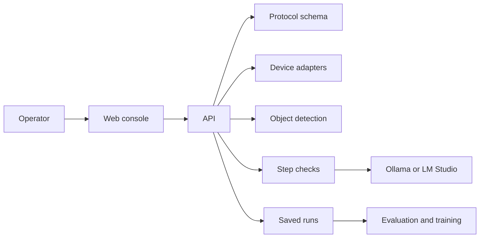

# OpenLabOS

OpenLabOS is an open-source protocol runner for camera-assisted laboratory
work. It presents a versioned protocol one step at a time and records the
session events associated with each run. Configured device and model paths can
add camera evidence and structured judgments.

OpenLabOS is pre-1.0 research software. It is **not** validated for clinical,
diagnostic, safety-critical, or regulated laboratory use.

## Quickstart: software-only demonstration

The default Docker Compose path requires no laboratory hardware or cloud
credentials.

```bash
docker compose up --build --wait
```

Open <http://localhost:3847/operate/kitchen>, select **Tea preparation**, and
start a guided run. The stack uses deterministic object detection. Interactive
step judgments use Ollama on the host when it is available.

With Node and pnpm installed, verify the service connections and complete a
protocol through the API:

```bash
pnpm compose:smoke
pnpm compose:protocol-run
pnpm compose:restart-persistence
```

`compose:restart-persistence` creates its own session, restarts the API, and
verifies that the session and its events remain available.

To enable interactive judgments with a local vision model:

```bash
ollama pull llama3.2-vision
ollama serve
```

Copy `.env.compose.example` to `.env` only when you need to change Compose
defaults — see the [Docker Compose runbook](docs/runbooks/docker-compose.md).

`docker compose down` keeps the artifact volume;
`docker compose down --volumes` deletes it.

For expected results and failure diagnosis, see
[First successful run](docs/runbooks/first-successful-run.md) and the
[Docker Compose runbook](docs/runbooks/docker-compose.md).

## What a run records

OpenLabOS uses four related records:

- A **Protocol** is a versioned sequence of steps.
- A **Session** is one attempt to execute a protocol. Its events are
  append-only.
- A **Judgment** is a model or deterministic provider's verdict on one step
  using the available evidence.
- A **RunManifest** is the shared contract intended to collect the protocol,
  events, judgments, and artifact pointers needed for review or replay.

The shared TypeScript schemas and emitted JSON Schema live in
`packages/protocol`. The API uses these records directly. Python services
currently use local Pydantic models or typed dictionaries, and the training
package can regenerate Python protocol types from the emitted schemas.

To write and run a protocol of your own, see
[Writing a protocol](docs/protocols/authoring.md); three validated examples
live in `examples/protocols/`. Measurement criteria declare acceptance
ranges; they become measurements only when evidence (or a
`measurement_recorded` event) carries an instrument or display-readout
method — see the authoring guide's evidence-channel section.

## Current scope

| Area | Status | Boundary |
|---|---|---|
| Protocol schemas and web console | Working | Versioned schemas, guided operator flow, and engineering views |
| Docker Compose demonstration | Working | Software-only path with deterministic perception and persisted sessions |
| Android device integration | Hardware-dependent | Implemented adapter and reference app; requires device setup |
| Ollama and LM Studio judgments | Experimental | Local providers; model quality and availability are external |
| Run review, replay, and export | Working, pre-1.0 | Implemented paths with contracts still stabilizing |
| Grounded SAM 2 object detection | Experimental | GPU overlay exists; requires NVIDIA runtime and model downloads |
| Training and evaluation | Experimental | Offline utilities, not part of the live run path |
| Webcam, ROS 2, and serial adapters | Planned / partial | Webcam scaffold only; ROS 2 and serial are not implemented |
| Voice coaching | Optional experiment | Requires LiveKit and provider configuration |

See the [roadmap](docs/architecture/roadmap.md) for the implementation backlog.

## Choose a runtime

| Setup | Requirements | Intended use |
|---|---|---|
| Default Compose | Docker Compose v2 | Reproduce the software-only demonstration |
| Compose with Ollama | Docker Compose v2, Ollama, vision model | Exercise interactive local judgments |
| Source development | Node 20+, pnpm 9+, Python 3.12, uv | Edit services with hot reload |
| Local device path | Source setup, ADB, supported Android device | Capture from the implemented hardware adapter |
| GPU overlay | NVIDIA GPU and Container Toolkit | Experiment with Grounded SAM 2 object detection |

## How the pieces fit



- The React web app shows the protocol and the live run.
- The Node API owns sessions, device connections, and artifacts on disk.
- Python services handle step checks and optional object detection.
- Training and evaluation read saved runs; they are not on the live path.

For the longer story, read the
[literate architecture](docs/architecture/literate-architecture.md), then
[ARCHITECTURE.md](ARCHITECTURE.md) and the
[decision records](docs/decisions/README.md).

## Develop from source

Prerequisites: Node 20+, pnpm 9+, Python 3.12, and
[uv](https://docs.astral.sh/uv/).

```bash
pnpm install
pnpm --filter @openlabos/protocol build
pnpm --filter @openlabos/preview build
pnpm --filter @openlabos/sdk-ts build
pnpm --filter @openlabos/device-android build
```

```bash
cp services/api/.env.example services/api/.env
pnpm --filter @openlabos/api dev
```

In another terminal, web at <http://localhost:5174>:

```bash
pnpm --filter @openlabos/web dev
```

```bash
pnpm typecheck
pnpm test:offline
```

`pnpm check` also runs the Python perception smoke and needs its smoke
dependencies. Device and provider tests stay explicitly separated; see
[Testing](docs/TESTING.md).

## Repository map

| Path | Purpose |
|---|---|
| `apps/web` | Operator console and engineering views |
| `apps/device-reference` | Reference Android device-owner app |
| `services/api` | Session API, device routing, artifact store |
| `services/inference` | Step-check service (vision model routing) |
| `services/perception` | Object detection and tracking |
| `services/training` | Dataset and model-adaptation utilities |
| `services/eval` | Metrics and hybrid validators |
| `services/voice` | Optional LiveKit voice agent |
| `packages/protocol` | Shared protocol and run schemas |
| `packages/preview` | Preview transport and metrics |
| `packages/sdk-ts` | TypeScript API client |
| `adapters/device-android` | Android adapter |
| `desktop` | Tauri desktop packaging |
| `examples/protocols` | Versioned example protocols |
| `docs` | Architecture, decisions, runbooks |

## Rules for contributors

- `packages/protocol` owns protocol and run wire formats.
- Device and model integrations stay behind typed contracts.
- The default operator workflow hides engineering controls.
- Session events and artifacts must support replay and audit.
- Cross-service decisions belong in append-only ADRs.
- Prose follows [docs/WRITING.md](docs/WRITING.md).

## Security and support

Compose binds to loopback. The API has no user accounts; an optional bearer
token exists for remote experiments, but that is not production identity.
Do not expose the stack to an untrusted network. Report issues privately via
[SECURITY.md](SECURITY.md).

Development workflow: [CONTRIBUTING.md](CONTRIBUTING.md).

## License

- **Code** (apps, services, packages, adapters, desktop, scripts, examples):
  [Apache-2.0](LICENSE).
- **Documentation** (`docs/`): [CC0 1.0](docs/LICENSE).

See [ADR 0018](docs/decisions/0018-dual-license.md) for the rationale.
