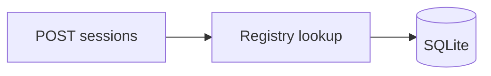
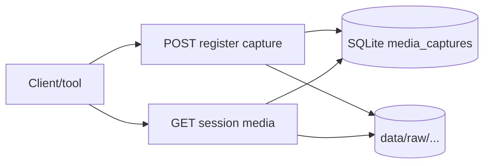
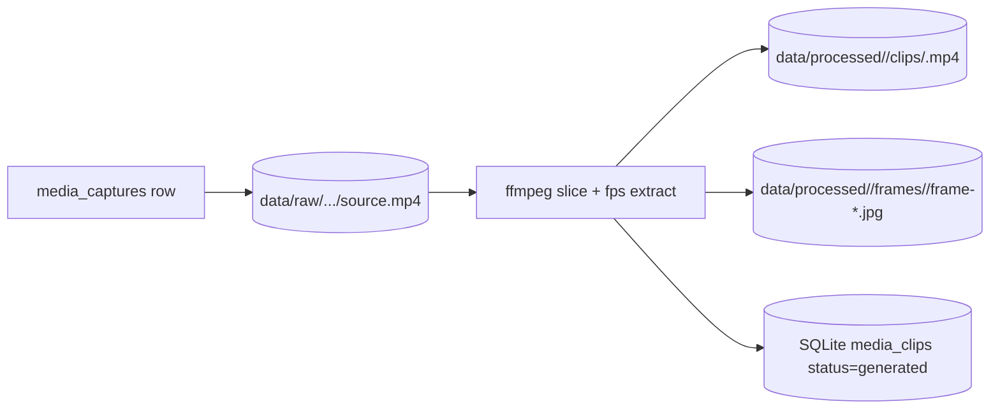
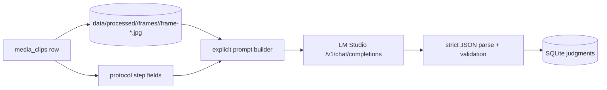

# Data flow (MVP)

## Protocol load (startup)

1. Resolve path via `LABOS_PROTOCOL_PATH` or default under monorepo `packages/protocol-schema/examples/`.
2. Read text with `pathlib.Path.read_text`, `json.loads`, `ProtocolDocument.model_validate`.
3. On any failure, raise a **clear error** including the path.
4. Registry is **read-only** after startup (no hot reload).

## Session create

1. Client sends `{ "protocol_id": "kitchen-tea-v1" }`.
2. API resolves protocol from registry; `422` if unknown `protocol_id` (clear detail string).
3. Insert one `sessions` row and one `session_steps` row per protocol step (sorted by `order`, then list order).
4. **First** step in that sort gets `status = active`; **all others** `pending`.

## Session read

1. `GET /sessions/{id}` loads `sessions` plus `session_steps` (ordered by internal `step_order`).
2. The handler passes the **registry** so each step row is enriched with the protocol’s **`title`** and **`order`** (JSON fields). The internal `step_order` column is not returned in JSON.

## What is not in this diagram yet

- Browser UI calling the API (Prompt 4).
- Media ingestion contract: captures and file layout (Prompt 5).
- LM Studio judgments (Prompt 7).

## Media ingestion contract (MVP)

In Prompt 5, media is **filesystem-first** and **manually inspectable**:

- SQLite stores **metadata only**, and stores only **data-relative paths** (rooted at repo `data/` or `LABOS_DATA_ROOT`).
- The database tracks **raw captures** and **registered clip segments** (no ffmpeg slicing yet).
- Extracted **frames** are a **directory contract** only; they may be listed from disk but are not first-class DB rows yet.

Key endpoints:
- `POST /sessions/{session_id}/media/captures`
- `GET /sessions/{session_id}/media`
- `POST /sessions/{session_id}/media/clips` (register clip placeholder)
- `PATCH /media/clips/{clip_id}/step` (associate)

## Media processing (Prompt 6)

Raw capture → fixed-duration clips → sampled frames:

The MVP processing entrypoint is a CLI (`scripts/process_capture.py`). No background workers.

## Inference (Prompt 7): LM Studio judgment

Clip frames + protocol step context → LM Studio → strict JSON judgment → SQLite row:

