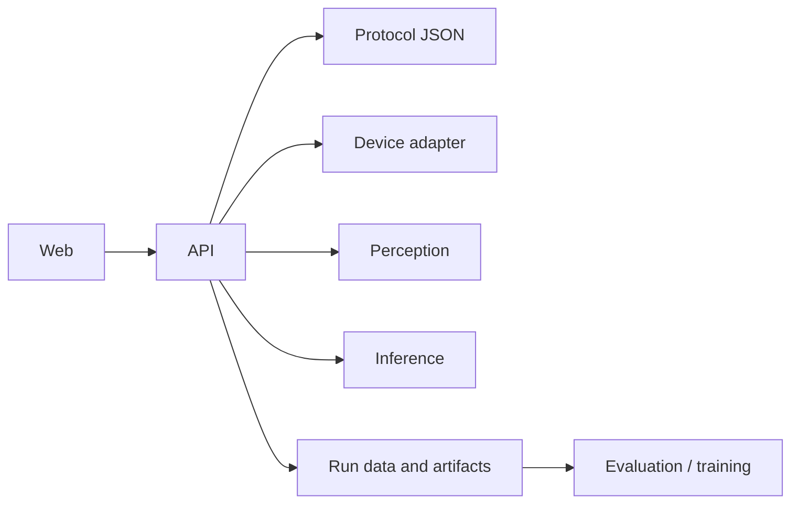

# System overview

In the default Docker stack, the web console and Node API share one public
port. Step checks and object detection run as separate Python services on the
internal Compose network.

## Major components

| Component | Role | Current state |
|---|---|---|
| `apps/web` | Operator workflow and engineering views | React/Vite |
| `services/api` | Sessions, device requests, and artifact storage | Express with mounted Hono routes |
| `services/inference` | Protocol-step checks (judgments) | FastAPI; Ollama/LM Studio/mock |
| `services/perception` | Object detection and tracking | FastAPI; mock or GPU backend |
| `packages/protocol` | Protocol, session, judgment, and run schemas | Zod plus emitted JSON Schema |
| `adapters/device-android` | Android HTTP/ADB integration | Implemented, hardware-dependent |
| `services/training` | Dataset and model-adaptation utilities | Experimental |
| `services/eval` | Metrics and hybrid validators | Experimental |

## Data flow

The browser speaks only to the API. The API forwards typed judgment requests
to the step-check service and segmentation requests to object detection.
Provider credentials and SDK behavior stay behind those service boundaries.

## State boundaries

- Protocols are versioned JSON documents validated by `packages/protocol`.
- Legacy kitchen routes store run media under the configured API data root.
- Hono session routes use the filesystem store by default and survive API
  restarts. Set `OPENLABOS_STORAGE_TIER=memory` only for ephemeral tests.
- Inference and the mock perception service are stateless.
- Compose persists API data and artifacts in named volumes.

## Runtime modes

- **Compose:** hardware-independent, loopback-only, mock perception, and host
  Ollama by default. Test scripts select the deterministic mock judgment
  provider. Device-specific legacy routes are disabled with `CLOUD_MODE`.
- **Source/local-device:** enables ADB and hardware control routes. Intended for
  a trusted workstation connected to a reference device.
- **Desktop:** Tauri packages the web UI and a local API sidecar.

## Security

Compose binds the API to `127.0.0.1`. Remote experiments can enable bearer
token checks, but they still need TLS and a reviewed reverse proxy. OpenLabOS
does not yet provide accounts, roles, or a production multi-user deployment.
See [SECURITY.md](../../SECURITY.md).

## Cross-language contracts

TypeScript owns the shared schemas and emits JSON Schema. Python services use
Pydantic models or typed dictionaries at runtime. The training service can
regenerate its Python protocol types from the emitted schemas; broader
cross-service generation remains planned.
