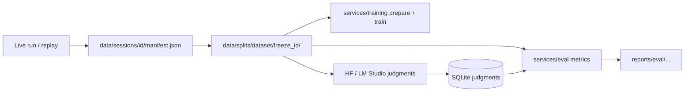

# Run to eval

Start with a completed session manifest, freeze a labeled split, write model
judgments, and score them with `services/eval`.

## Overview



## 1. Produce a replayable run manifest

After a kitchen run completes, the API writes a RunManifest under:

```text
data/sessions/<session_id>/manifest.json
```

The companion session record lives at `data/sessions/<session_id>/session.json`. Training helpers in `services/training/openlabos_training/session_manifest_io.py` read these files to resolve `protocol_id` without mutating the live API.

For kitchen adherence smoke checks, run the replay harness:

```bash
cd services/api
pnpm exec vitest run tests/replay/kitchen-tea-smoke/scenario.test.ts
```

## 2. Freeze a labeled dataset

Export or author `train.jsonl`, `val.jsonl`, and `test.jsonl` with the eval schema (`session_id`, `clip_id`, `step_id`, `objects_seen`, `action_detected`, `step_complete`, `possible_issue`).

A minimal reference fixture ships at:

```text
services/eval/fixtures/frozen-v1/
  manifest.json
  train.jsonl
  val.jsonl
  test.jsonl
```

Freeze a split and record its hashes:

```bash
cd services/eval
uv run openlabos-eval-metrics dataset freeze \
  --dataset-name kitchen-tea-smoke \
  --freeze-id frozen-v1 \
  --train  ../eval/fixtures/frozen-v1/train.jsonl \
  --val    ../eval/fixtures/frozen-v1/val.jsonl \
  --test   ../eval/fixtures/frozen-v1/test.jsonl \
  --out-root ../../data/splits
```

The freeze step writes `manifest.json` with SHA-256 hashes for each split file.

## 3. Prepare training artifacts (optional)

Regenerate Python protocol types from `packages/protocol/schema`:

```bash
cd services/training
uv sync --python 3.12 --extra codegen
uv run python scripts/regenerate-protocol-types.py
```

Prepare judgment SFT rows from the frozen split:

```bash
uv run openlabos-prepare-judgment-sft \
  --frozen-dir ../../data/splits/kitchen-tea-smoke/frozen-v1 \
  --sqlite ../../services/api/var/openlabos_sessions.sqlite \
  --data-root ../../data \
  --out-dir ./outputs/judgment-sft-prepared
```

The prepare step uses filesystem session manifests when present and falls back to SQLite for `session_id → protocol_id`.

## 4. Write judgments for eval

Baseline or post-SFT judgments must land in the API SQLite store under a distinct `model_id`:

```bash
uv run openlabos-infer-hf-judgments \
  --frozen-dir ../../data/splits/kitchen-tea-smoke/frozen-v1 \
  --split test \
  --sqlite ../../services/api/var/openlabos_sessions.sqlite \
  --data-root ../../data \
  --adapter-dir ./outputs/my-sft-run \
  --judgment-model-id hf-sft:my-sft-run
```

## 5. Score the frozen split

Run offline metrics against the held-out split:

```bash
cd services/eval
uv run openlabos-eval-metrics judgments \
  --dataset ../../data/splits/kitchen-tea-smoke/frozen-v1/test.jsonl \
  --sqlite  ../../services/api/var/openlabos_sessions.sqlite \
  --out     ../../reports/eval/kitchen-tea-smoke-frozen-v1
```

Package the baseline configuration, report, and lock file:

```bash
uv run openlabos-eval-metrics baseline \
  --dataset-dir ../../data/splits/kitchen-tea-smoke/frozen-v1 \
  --sqlite      ../../services/api/var/openlabos_sessions.sqlite
```

## Outputs

| Stage | Artifact |
| --- | --- |
| Run | `data/sessions/<id>/manifest.json` |
| Freeze | `data/splits/<dataset>/<freeze_id>/manifest.json` |
| Prepare | `outputs/.../sft_train.jsonl`, `dataset-manifest.json` |
| Train | `outputs/.../run-manifest.json`, adapter weights |
| Eval | `reports/eval/.../judgment-eval.{json,md}`, `baseline-lock.json` |

## Reporting requirements

Before citing a number from `services/eval` in a paper, issue, or roadmap
claim, the report must include:

1. **Sample size (n)** for every metric — overall and per `step_id`.
2. **Per-step breakdowns**, not only a pooled accuracy. Step difficulty
   varies; a single number hides that.
3. **Uncertainty** — bootstrap confidence intervals (or another stated
   method) at these dataset sizes.
4. **False-accept rate** — include known-failure fixtures (labeled frames
   where the step was *not* done correctly). Agreement on successes alone
   does not measure safety-relevant error.
5. **Label quality** — if humans produce labels, report inter-rater
   agreement (e.g. Cohen's κ) before treating labels as ground truth.
6. **Producer identity** — group and report by judgment `source` (model id
   and parameters). Do not pool judgments from different versions or
   sampling settings.
7. **Calibration (when using confidence)** — if any policy or UI thresholds
   on `observed_objects[].confidence`, publish a reliability diagram or
   expected calibration error for that producer first. Uncalibrated
   self-reports are not probabilities.

## Boundaries

- `services/eval` is offline-only; it never starts the API or training runtime.
- Frozen splits are immutable once written; create a new `freeze_id` instead of editing held-out rows.
- Replay harnesses validate deterministic adherence policy behavior, not live VLM quality.
- Replaying a session reconstructs state from events; it does not recompute
  model judgments. Judgments in a manifest are historical observations.
